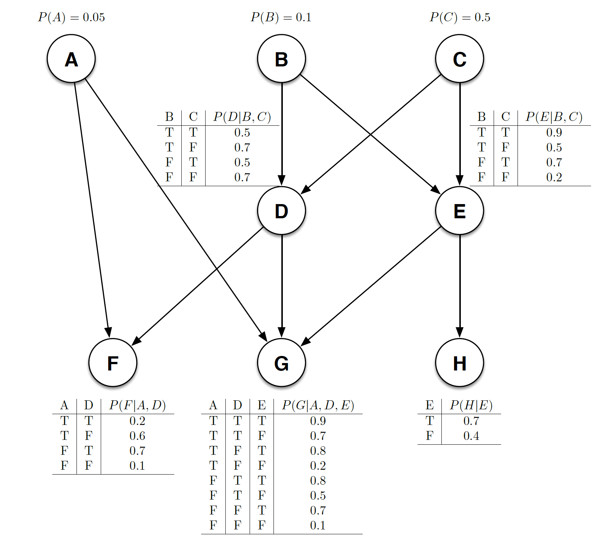

# Baysian Network

Give a network below. You can use the R Baysian Network Learning library (bnlean) to calculate conditonal probabilities 

For instance given that you know G is false and F is true, what is the probability that D is true?

The [R script](baysian_inference.R) calculates the probability. Though I have been so lazy to verify if the implemetation is correct.
